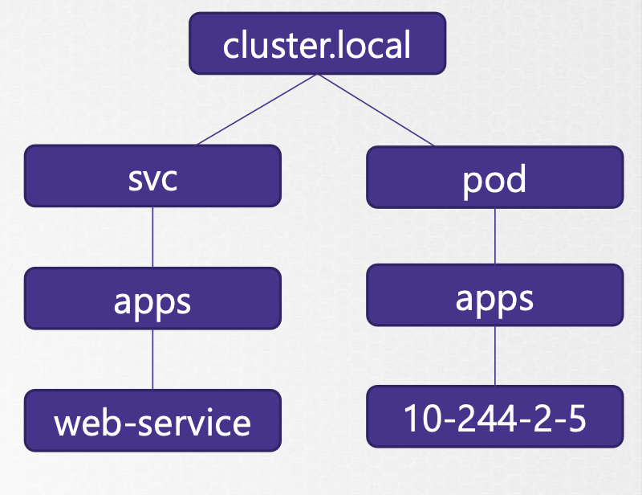

## DNS IN KUBERNETES

- Kubernetes deploys a built-in DNS server Kube DNS by default when we set up a cluster

- If the pod and service are in the same namespace, the pod can refer to service by its name directly

    Eg: We have a service with name web-service
    1. The pod in the same namespace can access it like this:

           $ curl https://web-service
    2. Assuming that the web-service was in a separate namespace named `apps`. Then the pod in a separate namespace can access it like this:

           $ curl https://web-service.apps

- For each namespace, the DNS server creates a subdomain. All the services are grouped together in another subdomain called `svc`. So you can reach your application using name `https://web-service.apps.svc`

- All the services and pods are grouped together into a root domain for the cluster which is set to `cluster.local` by default. So you can access the service using `https://web-service.apps.svc.cluster.local` which is FQDN for the service

- For pods, the records are not enabled by default. We can enable them manually. They are not assigned any names rather `periods (.) in their IP addresses gets converted to dashes (-)`. The namespace remains the same and the type is set to `pods`

    
           
   
