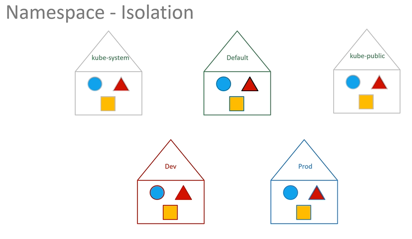
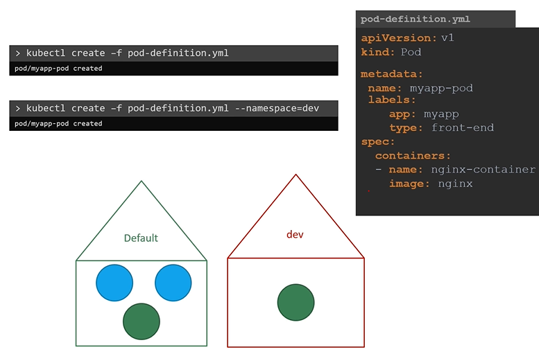
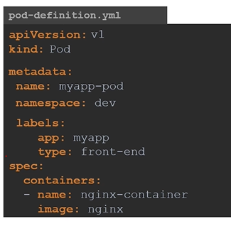
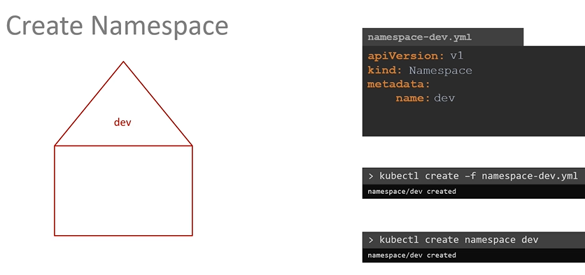
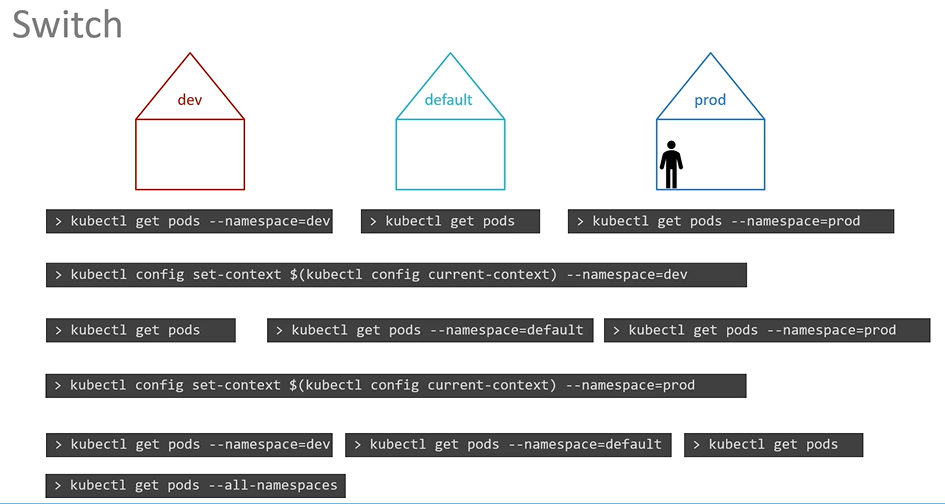

## NAMESPACES

In this section, we will take a look at **`Namespaces`**

So far in this course we have created **`Objects`** such as **`PODs`**, **`Deployments`** and **`Services`** in our cluster. Whatever we have been doing we have been doing in a **`NAMESPACE`**
- This namespace is the **`default`** namespace in kubernetes. It is automatically created when kubernetes is setup initially

  

- You can create your own namespaces as well

  

- To list the pods in default namespace
  ```
  $ kubectl get pods
  ```
- To list the pods in another namespace. Use **`kubectl get pods`** command along with the **`--namespace`** flag or argument.
  ```
  $ kubectl get pods --namespace=kube-system
  ```

  

- Here we have a pod definition file, when we create a pod with pod-definition file, the pod is created in the default namespace.

    ```
    apiVersion: v1
    kind: Pod
    metadata:
    name: myapp-pod
    labels:
        app: myapp
        type: front-end
    spec:
    containers:
    - name: nginx-container
        image: nginx
    ```
    ```
    $ kubectl create -f pod-definition.yaml
    ```
- To create the pod with the pod-definition file in another namespace, use the **`--namespace`** option.
  ```
  $ kubectl create -f pod-definition.yaml --namespace=dev
  ```

  

- If you want to make sure that this pod gets you created in the **`dev`** env all the time, even if you don't specify in the command line, you can move the **`--namespace`** definition into the pod-definition file.
    ```
    apiVersion: v1
    kind: Pod
    metadata:
    name: myapp-pod
    namespace: dev
    labels:
        app: myapp
        type: front-end
    spec:
    containers:
    - name: nginx-container
        image: nginx
    ```
    
- To create a new namespace, create a namespace definition as shown below and then run **`kubectl create`**
    ```
    apiVersion: v1
    kind: Namespace
    metadata:
    name: dev
    ```
   ```
  $ kubectl create -f namespace-dev.yaml
  ```
  Another way to create a namespace
  ```
  $ kubectl create namespace dev
  ```
  

- By default, we will be in a **`default`** namespace. To switch to a particular namespace permenently run the below command.
  ```
  $ kubectl config set-context $(kubectl config current-context) --namespace=dev
  ```
- To view pods in all namespaces
  ```
  $ kubectl get pods --all-namespaces
  ```

  

- To limit resources in a namespace, create a resource quota. To create one start with **`ResourceQuota`** definition file.
    ```
    apiVersion: v1
    kind: ResourceQuota
    metadata:
    name: compute-quota
    namespace: dev
    spec:
    hard:
        pods: "10"
        requests.cpu: "4"
        requests.memory: 5Gi
        limits.cpu: "10"
        limits.memory: 10Gi
    ```
  ```
  $ kubectl create -f compute-quota.yaml
  ```

  