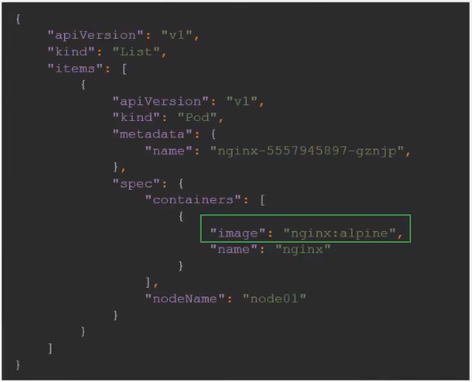

##  ADVANCE KUBECTL COMMANDS

- Take me to the [Lecture](https://kodekloud.com/topic/advanced-kubectl-commands/)

  - To get the output of **`kubectl`** in a json format: 

    ```
    $ kubectl get nodes -o json
    ```

    ```
    $ kubectl get pods -o json 
    ```
    

 - To get the image name used by pod via json path query:

    ```
    $ kubectl get pods -o=jsonpath='{.items[0].spec.containers[0].image}'
    ```

  - To get the names of node in the cluster:

    ```
    $ kubectl get pods -o=jsonpath='{.items[*].metadata.name}'
    ```

    

 - To get the architecture of node in the cluster:

    ```
    kubectl get pods -o=jsonpath='{.items[*].status.nodeInfo.architecture}'
    ```

  - To get the count of the cpu of node in the cluster:

    ```
    kubectl get pods -o=jsonpath='{.items[*].status.status.capacity.cpu}'
    ```

  #### Loops - Range

  - To print the output in a separate column (one column with node name and other with CPU count) (no need to add "items" in the beginning as it assumes by default that the query is for each item  ):

    ```
    kubectl get nodes -o=custom-columns=NODE:.metadata.name ,CPU:.status.capacity.cpu
    ```
    

- Kubectl comes with a **`sort by`** property which can be combined with json path query to **`sort`** by name or **`CPU count`**

    ```
    kubectl get nodes --sort-by=.metadata.name
    ```
    

    ```
    kubectl get nodes --sort-by=..status.capacity.cpu
    ```