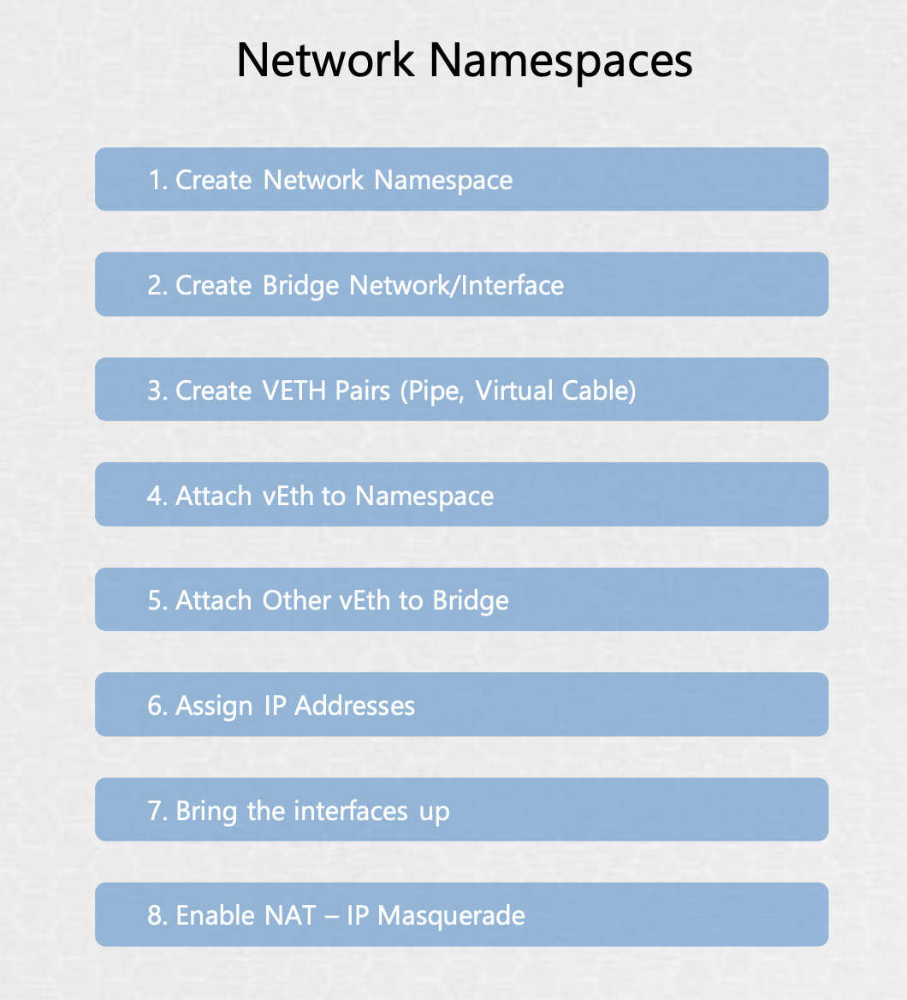
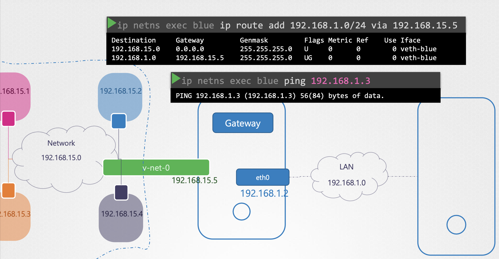

## :houses: NETWORK NAMESPACES

- Used by containers like Docker to implement network isolation

- In order to hide host network information from its containers, we implement network namespace. Then the container can have its own routing and ARP tables within its network namespace and will not be able to see routing and ARP tables of the host

    

- Create a new network namespace on a linux host

       $ ip netns add <name>

- To list available network namespaces
  
        $ ip netns

- To run a command in a network namespace

        $ ip netns exec <name> <command>

        eg: $ ip netns exec red ip link

   OR
 
         $ ip -n <network-namespace-name> link
         
         eg: $ ip -n red link
         
### :diamond_shape_with_a_dot_inside: ESTABLISHING CONNECTIVITY BETWEEN NETWORK NAMESPACES

Connect two network namespaces together using a virtual ethernet pair or a virtual cable. It is referred to as a pipe. 

1. Create the cable

         $ ip link add <1st-veth-name> type veth peer name <2nd-veth-name>

2.  Attach veth to the appropriate namespace

         $ ip link set <veth-name> netns <network-namespace-name>

3. Assign ip address to each namespace

         $ ip -n <network-namespace-name> addr add <ip-address> dev <veth-name>

4. Bring up the interface

         $ ip -n <network-namespace-name> set <veth-name> up

5. Now try pinging one network namespace to another

         $ ip netns exec <network-namespace-name> ping <ip-of-another-network-namespace>

If there are more than 2 network namespaces and we want to enable communication between them, we need virtual switch

1. Create virtual switch using one of the solutions available i.e. linux bridge

         $ ip link add <virtual-switch-name> type bridge

         eg: $ ip link add v-net-0 type bridge

2. Bring the switch up
        
        $ ip link set dev <switch-name> up

        eg: $ ip link set dev v-net-0 up

    `This is like an interface for the host and switch for the network namespaces`

3. Delete the link between two network namespaces if any (after creating virtual switch)

        $ ip -n <network-namespace-name> link del <veth-name>

        eg: $ ip -n red link del veth-red

   This also deletes the other end of the link/cable

4. Create another link to attach the network namespace with the virtual switch

        $ ip link add <veth-name-on-namespace-side> type veth peer name <veth-name-on-switch-side>

        eg: $ ip link add veth-red type veth peer name veth-red-br

5. Attach the one end of the cable with the namespace

         $ ip link set <veth-name-on-namespace-side> netns <network-namespace-name>

         eg: $ ip link set veth-red netns red

6. Attach another end of the cable with the switch

         $ ip link set <veth-name-on-switch-side> master <switch-name>

         eg: $ ip link set veth-red-br master v-net-0

7. Assign IP address for the links

          $ ip -n <namespace-name> addr add <ip-address> dev <veth-name>

          eg: $ ip -n red addr add 192.168.15.1 dev veth-red

8. Turn the device up

          $ ip -n <namespace-name> link set <veth-name> up

          eg: $ ip -n red link set veth-red up 

### :diamond_shape_with_a_dot_inside: ESTABLISHING CONNECTIVITY BETWEEN HOST AND NETWORK NAMESPACES

As mentioned earlier, switch is like an interface for the host. So we just need to assign an IP address to this interface in order for host to be able to communicate with the switch

1. Assign IP address to the switch

        $ ip addr add <ip-address> dev <switch-name>

        eg: $ ip addr add 192.168.15.5/24 dev v-net-0

### :diamond_shape_with_a_dot_inside: ESTABLISHING CONNECTIVITY TO THE OUTSIDE WORLD

1. Check routes on your network namespace

        $ ip -n <namespace-name> route

        eg: $ ip -n red route

2. The only thing that can connect the network namespace to the outside world is a gateway. Here, the switch will act as a gateway because it is an interface for the host so it can communicate with the outside world. So add it as a gateway on your network namespace

        $ ip -n <namespace-name> ip route add <local-area-network-with-cidr> via <switch-ip-address>

        eg: ip -n red ip route add 192.168.1.0/24 via 192.168.15.5
   

    

3. Now when we ping the network outside the host, we get connectivity but we don't get any response back. We need `NAT` enabled on our host acting as a gateway so that it can send the messages to the LAN with its own name and its own address.

   Add NAT functionality to the host:

        $ iptables -t nat -A POSTROUTING -s <virtual-network-ip-address> -j MASQUERADE

        eg: $ iproutes -t nat -A POSTROUTING -s 192.168.15.0/24 -j MASQUERADE

4. To allow our network namespaces to be able to connect to the internet, we can add host (swithc ip address) as our default gateway

        $ ip -n <namespace-name> ip route add default via <switch-ip-address>

        eg: $ ip -n red ip route add default via 192.168.15.5
