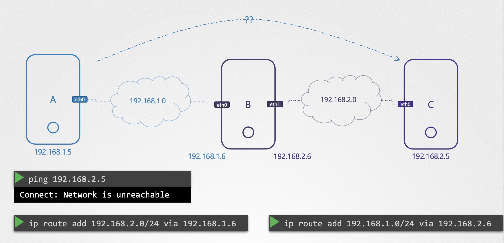

##  SWITCHING & ROUTING

###  SWITCH:
- Enables communication between devices within the `same network`
- To connect devices to a switch, we need an interface on each host. To see list or modify interfaces on a host, run below command

       $ ip link

- After linking the interfaces with the switch, we assign devices the ip addresses within that network using below command

       $ ip addr add <ip_with_cidr> dev <interface-name>

       eg: ip addr add 192.168.1.10/24 dev eth0
       NOTE: Changes by this command are only valid till the system restarts. To persist these changes, make changes to /etc/network-interfaces file
- Once the links are up and ip addresses have been assigned, the devices can communicate with each other through switch
- To see ip address assigned to the interfaces

       $ ip addr

## :door: ROUTER & GATEWAY:
 - Helps connect two networks together
 - We connect router to the two different networks and assign 2 ips to the router to enable communication
 - Consider network as a room and gateway or route as a door/gate to the outside world or an internet or to other networks
 - We configure systems with a gateway/route. A gateway shows system from where to communicate with the system in another network (gives ip address assigned to router for another network)
 - To see the existing routing configuration

         $ route
         $ ip route 
- To configure a gateway on system B to reach the systems on network say 2.0, run below command (assume that the ip address assigned to the router for system B is 192.168.1.1)

         $ ip route add 192.168.2.0/24 via 192.168.1.1
- For any network that you don't know route to, use this router as the default gateway

         $ ip route add default via <ip-of-system>

   This way, any request to any network outside of your existing network, goes to this particular router
- A `0.0.0.0` entry in the gateway field indicates that you don't need a gateway (eg: communication between systems within the same network)

- Configuring a linux host as a router. Here, host B acts as a router between host A and host B. Both the hosts will need to be configured with the gateway in order to communicate with each other 
  

  - By default in linux, packets are not forwarded from one interface to another (eth0 to eth1 or vice-versa in our case) and so when you ping from one host to another, you still do not get any response
  - We need to explicitly allow the host to forward traffic from one interface to another by a setting located at `/proc/sys/net/ipv4/ip_forward`. By default, its value is `0` which means it is not allowed to forward the traffic
  - Allow the host to forward traffic from one interface to another b
      - Changing value of `/proc/sys/net/ipv4/ip_forward` to `1`
      AND
      - Changing value of `net.ipv4.ip_forward` setting to `1` at `/etc/sysctl.conf`

